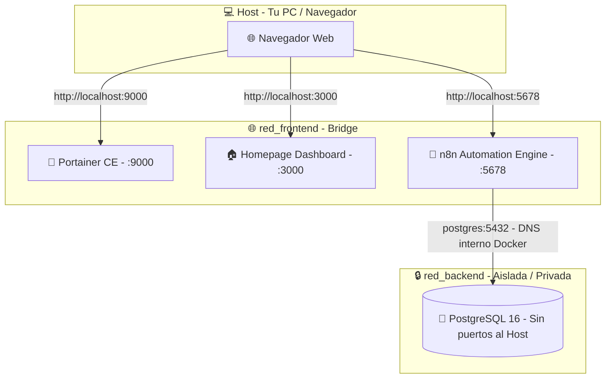

# 🛡️ Proyecto 6.0: Homelab Automation Stack

## 🎯 Objetivo del Proyecto
Este proyecto deja de lado la programación de código puro para centrarse en la **Arquitectura de Sistemas, Ciberseguridad y DevOps**.

El objetivo es desplegar un servidor de automatización y gestión (*Homelab*) local utilizando **Docker Compose**, aplicando estándares profesionales de la industria:
- **Zero-Trust Networking**: Bases de datos aisladas en redes privadas sin puertos expuestos al host.
- **Gestión Segura de Secretos**: Inyección de credenciales mediante `.env` sin hardcodear datos sensibles.
- **Orquestación Resiliente**: Chequeos de salud (*healthchecks*) automatizados para evitar condiciones de carrera (*race conditions*).
- **Dashboard Centralizado**: Panel visual de control con *Bind Mounts* para actualización en tiempo real.

---

## 🛠️ Tecnologías y Servicios Utilizados

El stack orquesta **4 contenedores** interconectados mediante Docker Compose:

* **🐳 Docker & Docker Compose:** Motor de contenedorización y orquestación de la infraestructura.
* **🐘 PostgreSQL (16-alpine):** Base de datos relacional robusta que actúa como almacén de datos persistente para n8n y flujos de trabajo.
* **🤖 n8n:** Motor líder de automatización de flujos de trabajo *low-code/no-code* (alternativa autoalojada a Zapier/Make).
* **🚢 Portainer CE:** Interfaz gráfica de administración web para monitorizar contenedores, imágenes, volúmenes y redes sin necesidad de recurrir a la terminal.
* **🏠 Homepage:** Panel de control (*dashboard*) moderno, modular y estético para agrupar accesos directos y widgets meteorológicos/sistema.

---

## 🏗️ Arquitectura y Ciberseguridad




### Principios Clave Implementados:

1. **Redes Aisladas (Zero Trust):**
   - Se configuran dos redes independientes: `red_frontend` y `red_backend`.
   - **PostgreSQL** reside exclusivamente en `red_backend` y **no expone ningún puerto (`ports`) al host**. Es invisible e inaccesible desde el exterior del stack.
   - **n8n** tiene acceso a ambas redes: expone su interfaz web a través de `red_frontend` y se comunica de forma privada y segura con la base de datos a través de `red_backend`.

2. **Healthchecks (Control de Condiciones de Carrera):**
   - Las bases de datos tardan unos segundos en inicializar el motor de almacenamiento.
   - Se implementa un `healthcheck` con `pg_isready -U ${DB_USER} -d ${DB_NAME}` cada 10 segundos.
   - n8n utiliza `depends_on: postgres: condition: service_healthy`, garantizando que jamás arrancará hasta que PostgreSQL esté completamente operativo.

3. **Inyección de Secretos (`.env`):**
   - Ninguna contraseña o dato sensible reside en `docker-compose.yml`. Todos los valores se parametrizan y cargan dinámicamente desde el archivo `.env`.

4. **Políticas de Alta Disponibilidad (`restart: unless-stopped`):**
   - Si el equipo se reinicia o un servicio colapsa, Docker restaura automáticamente los contenedores a su estado operativo.

---

## 📂 Estructura de Archivos

```text
6.0-homelab-automation-stack/
├── .env                    # Variables de entorno y credenciales (ignorado en Git)
├── docker-compose.yml      # Manifiesto de orquestación de servicios, redes y volúmenes
├── homepage_data/          # Configuración personalizada de Homepage (Bind Mount)
│   ├── bookmarks.yaml      # Marcadores y enlaces directos
│   ├── services.yaml       # Servicios monitorizados e infraestructura
│   ├── settings.yaml       # Estética, modo oscuro y personalización visual
│   └── widgets.yaml        # Widgets en tiempo real (OpenMeteo)
└── README.md               # Documentación completa del proyecto
```

---

## 🌐 Resumen de Puertos y Accesos

| Servicio | Puerto Host | Puerto Contenedor | Redes | Acceso |
| :--- | :--- | :--- | :--- | :--- |
| **Portainer CE** | `9000` | `9000` | `red_frontend` | `http://localhost:9000` |
| **n8n** | `5678` | `5678` | `red_frontend`, `red_backend` | `http://localhost:5678` |
| **Homepage** | `3000` | `3000` | `red_frontend` | `http://localhost:3000` |
| **PostgreSQL** | *Ninguno (Oculto)* | `5432` | `red_backend` | `postgres:5432` *(Solo interno)* |

---

## 💻 Comandos Clave (Manual de Operaciones)

### 1. Iniciar la infraestructura
Levanta todos los servicios en segundo plano:
```bash
docker compose up -d
```

### 2. Verificar estado y salud de los contenedores
Permite comprobar si PostgreSQL está `healthy` y ver los puertos mapeados:
```bash
docker compose ps
```

### 3. Consultar logs de un servicio específico
Útil para depurar o verificar la inicialización de n8n o PostgreSQL:
```bash
docker compose logs -f n8n
docker compose logs -f postgres
```

### 4. Detener la infraestructura
- **Detener manteniendo los datos:**
  ```bash
  docker compose down
  ```
- **Detener eliminando volúmenes (Reinicio desde cero):**
  ```bash
  docker compose down -v
  ```

---

## ⚙️ Casos de Uso y Prácticas Implementadas

### 1. Flujo de Automatización con n8n y PostgreSQL Blindado
Se diseñó un flujo de trabajo automatizado que extrae información desde una API pública externa y la persiste directamente en la base de datos interna.

#### A. Creación de tabla en PostgreSQL (vía consola de Portainer o CLI):
```bash
docker compose exec -it postgres psql -U izan_admin -d n8n_database
```

```sql
CREATE TABLE IF NOT EXISTS citas_celebres (
    id SERIAL PRIMARY KEY,
    autor VARCHAR(100) NOT NULL,
    frase TEXT NOT NULL,
    fecha_creacion TIMESTAMP DEFAULT CURRENT_TIMESTAMP
);
```

#### B. Pipeline en n8n:
1. **Trigger Manual / Cron:** Dispara la ejecución según temporizador.
2. **HTTP Request Node:** Consulta la API pública `https://dummyjson.com/quotes/random`.
3. **Postgres Node:** Conectado mediante host `postgres` (DNS de Docker), usuario `${DB_USER}` y base de datos `${DB_NAME}`.
4. **Mapeo de Datos:** Inserción de expresiones dinámicas:
   - `autor`: `{{ $json.author }}`
   - `frase`: `{{ $json.quote }}`

---

### 2. Personalización en Vivo de Homepage mediante Bind Mounts
Gracias al montaje de tipo Bind Mount (`./homepage_data:/app/config`), cualquier cambio en los archivos YAML locales se refleja de inmediato en el navegador sin reiniciar el contenedor.

#### `services.yaml` (Tarjetas de Servicios)
```yaml
- Mi Infraestructura:
    - Portainer:
        icon: portainer.png
        href: http://localhost:9000
        description: Gestión visual de contenedores

    - n8n:
        icon: n8n.png
        href: http://localhost:5678
        description: Motor de automatización de flujos

    - GitHub:
        icon: github.png
        href: https://github.com/izann06?tab=repositories
        description: Repositorios de Izan
```

#### `widgets.yaml` (Información Meteorológica sin API Key)
```yaml
- openmeteo:
    label: Villafranqueza
    latitude: 38.3789
    longitude: -0.5019
    timezone: Europe/Madrid
    units: metric
    format: "%t - %d"
```

#### `settings.yaml` (Diseño y Tema Oscuro)
```yaml
background:
  image: "https://imgs.search.brave.com/vwjMfIiZjBeYwX3H7XAd6jzpLVrXuMD_cS3aznRYdWE/rs:fit:500:0:1:0/g:ce/aHR0cHM6Ly93MC5w/ZWFrcHguY29tL3dh/bGxwYXBlci84MDMv/OTIwL0hELXdhbGxw/YXBlci1yb2NreS1i/YWxib2EtYmFsYm9h/LWFjdG9yLXN5bHZl/c3Rlci1zdGFsbG9u/ZS10aHVtYm5haWwu/anBn"
  blur: sm
  brightness: 50
  saturate: 75

theme: dark
```